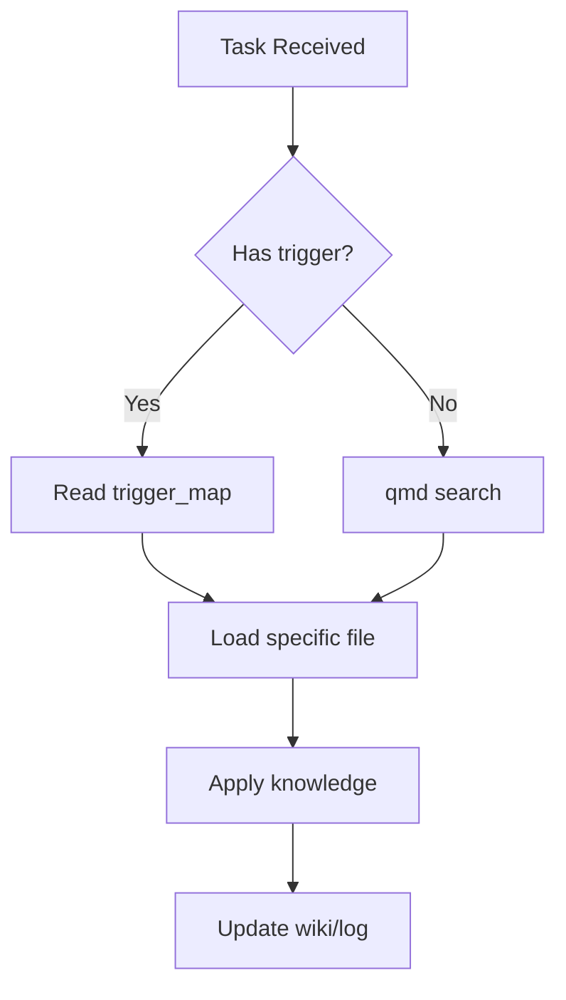

# Project Structure — Module **Blog**

## Directory Structure

```
./laravel/Modules/Blog/docs/
├── wiki/                          # Knowledge base locale (LLM Wiki)
│   ├── index.md                  # Master catalog
│   ├── log.md                    # Activity log
│   ├── concepts/                 # Topic/theme pages
│   ├── entities/                 # Organization/person pages
│   ├── rules/                    # ⚠️ 151+ regole progettuali
│   │   ├── 00-INDEX.md          # Indice regole
│   │   ├── 00-TRIGGER_MAP.md    # Trigger map (link a globale)
│   │   └── *.md                 # Regole specifiche modulo
│   ├── skills/                   # Skill progettuali
│   │   ├── INDEX.md
│   │   └── *.md
│   ├── commands/                 # Comandi progettuali
│   │   ├── INDEX.md
│   │   └── *.md
│   ├── memories/                 # Memorie progettuali
│   │   ├── INDEX.md
│   │   └── *.md
│   ├── decisions/                # Architecture decision records
│   └── troubleshooting/          # Bug fixes, error resolutions
├── ON-DEMAND-PATTERN.md          # 🌟 QUESTO FILE — Pattern on-demand
├── QMD-SETUP.md                  # Configurazione QMD
├── PERFORMANCE-OPTIMIZATION.md    # Metriche e best practice
├── ARCHITECTURE.md               # (opzionale) Architettura modulo
└── README.md                     # (opzionale) Overview modulo
```

## File Chiave

| File | Purpose |
|------|---------|
|  | Catalogo di tutto il sapere del modulo |
|  | Storico attività (ingest/query/lint) |
|  | Regole + trigger map locale |
|  | Concetti specifici del modulo |
|  | **Leggi prima** — pattern da seguire |

## Convenzioni

### Naming

- **Filenames**: lowercase-kebab-case.md
- **Directories**: lowercase
- **Titles**: Title Case

### Frontmatter Schema

```yaml
---
title: "Page Title"
type: concept|entity|source|comparison|decision|troubleshooting
sources: []  # Solo per raw sources
confidence: high|medium|low
created: YYYY-MM-DD
updated: YYYY-MM-DD
tags: [tag1, tag2]
related:
  - ../concepts/related.md
---
```

### Link Rules

- **Interno modulo**: `[[concepts/page]]` o `[link](./concepts/page.md)`
- **Modulo altro**: `[[../../OtherModule/docs/wiki/concepts/page]]`
- **Project wiki**: `[Global rule](../../docs/wiki/rules/rule.md)`

## Workflow con On-Demand Pattern



## Riferimenti Globali

- [Project Wiki Root](../../docs/wiki/)
- [Global Rules](../../docs/wiki/rules/)
- [Global Skills](../../docs/wiki/skills/)
- [Global Commands](../../docs/wiki/commands/)
- [Global Memories](../../docs/wiki/memories/)

## Setup Initiale (per nuovi moduli)

```bash
# 1. Crea struttura wiki
mkdir -p docs/wiki/{rules,skills,commands,memories,concepts,entities,decisions,troubleshooting}

# 2. Crea INDEX files
cp docs/wiki/rules/INDEX.md docs/wiki/rules/
cp docs/wiki/skills/INDEX.md docs/wiki/skills/
# ... etc

# 3. Aggiungi a QMD collection (opzionale, già incluso global)
# Il .qmd/index.yml include automaticamente docs/**/wiki/

# 4. Committa
git add docs/
git commit -m "docs: add wiki structure for Blog"
```

---
*Pattern: On-Demand | Source: docs/wiki/*
