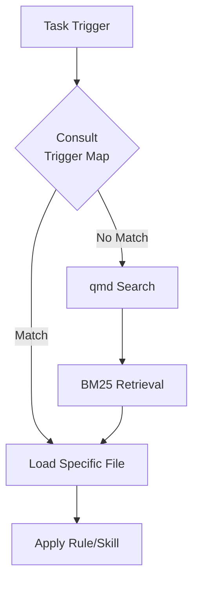

# QMD Setup per Module **Blog**

## Configurazione QMD per Questo Module

### Collection Configuration

Il progetto usa una collection QMD centralizzata in  che include:

```yaml
collection:
  name: fixcity
  source: docs/wiki  # Include tutti i moduli
  
paths:
  include:
    - docs/wiki/rules/**/*.md
    - docs/wiki/skills/**/*.md
    - docs/wiki/commands/**/*.md
    - docs/wiki/memories/**/*.md
    - ./laravel/Modules/Blog/docs/wiki/**/*.md  # ← Questo modulo
```

### Ricerca Locale vs Globale

**Ricerca locale** (solo questo modulo):
```bash
qmd search "<topic>" -c Blog
# Cerca solo in ./laravel/Modules/Blog/docs/wiki/
```

**Ricerca globale** (tutto il progetto):
```bash
qmd search "<topic>"
# Cerca in docs/wiki/ + tutti i moduli
```

### Cache Location

- **Cache path**: ${HOME}/.cache/qmd-cache/
- **Fuori dal repo**: ✅ OK — non committata
- **Pulizia cache**: `rm -rf ~/.cache/qmd-cache/`

### Performance Tips

1. **Rebuild index dopo modifiche**:
```bash
qmd index rebuild --force
```

2. **Usa -c per limitare scope**:
```bash
qmd search "form" -c Blog   # Solo questo modulo
```

3. **Evita query troppo generiche** — più specifico = risultati migliori

## Integrazione con l'On-Demand Pattern



## Troubleshooting

| Problema | Soluzione |
|----------|-----------|
| Risultati non aggiornati | `qmd index rebuild --force` |
| Ricerca lenta | Limita con `-c Blog` |
| Cache corrotta | `rm -rf ~/.cache/qmd-cache/` |

## Riferimenti

- [Global QMD Config](../qmd.md) (root docs)
- [Operational Discipline](../../docs/wiki/concepts/llm-wiki-operational-discipline.md)
- [On-Demand Pattern](./ON-DEMAND-PATTERN.md)

---
*Cache: ~/.cache/qmd-cache/ | Index: ~/.cache/qmd-cache/index*
