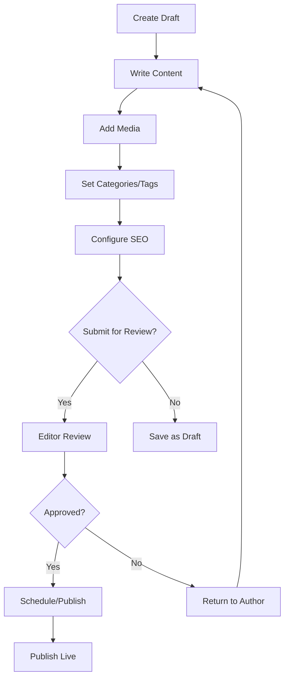

# Product Requirements Document (PRD) - Blog Module

**Module**: Blog
**Version**: 1.0
**Status**: Draft
**Author**: Product Team

---

## Document Control

| Version | Date | Author | Changes |
|---------|------|--------|---------|
| 1.0 | 2026-03-12 | Product Team | Initial draft |

---

## 1. Executive Summary

### 1.1 Problem Statement
> Content publishing platforms require robust article management, editorial workflows, categorization, tagging, and multi-author support. Without a dedicated blog module, content creation becomes fragmented, editorial oversight is limited, and content discoverability suffers. The platform needs a centralized content management system that supports the full editorial lifecycle from draft to publication, with proper versioning, scheduling, and SEO optimization.

### 1.2 Proposed Solution
> The Blog module provides a comprehensive content publishing platform with article management, editorial workflows, category and tag organization, author management, scheduling, and SEO features. It integrates with the Cms module for page building, Media module for asset management, and Seo module for optimization. The module supports multi-author workflows, content versioning, scheduled publishing, and provides both admin and public-facing interfaces.

### 1.3 Business Value Proposition
- **Primary Value**: Professional content publishing platform for editorial teams
- **Secondary Value**: SEO-optimized content structure, improved discoverability
- **Strategic Alignment**: Foundation for content marketing, thought leadership, and organic traffic growth

### 1.4 Success Metrics (High-Level)
| Metric | Current | Target | Timeline |
|--------|---------|--------|----------|
| Article Publishing Rate | N/A | 10+ articles/week | Q3 2026 |
| Editorial Workflow Adoption | N/A | 100% of content | Q2 2026 |
| SEO Score Average | N/A | 85+ | Q3 2026 |
| Content Discoverability | N/A | 60% via internal links | Q3 2026 |

---

## 2. Goals & Objectives

### 2.1 Primary Goals (SMART)
1. **Specific**: Build complete editorial workflow from draft to publication with versioning
2. **Measurable**: Support 10+ articles/week publishing rate with 100% workflow adoption
3. **Achievable**: Leverage Filament admin, Media integration, and Seo module
4. **Relevant**: Critical for content marketing and organic growth strategy
5. **Time-bound**: Core publishing by Q2 2026, advanced features by Q3 2026

### 2.2 Secondary Goals
- Implement content analytics and performance tracking
- Build content recommendation engine
- Create newsletter integration
- Develop content calendar and planning tools

### 2.3 Non-Goals
> What this module will NOT do (scope boundaries)
- Page building and layout design (handled by Cms module)
- Media storage and manipulation (handled by Media module)
- Comment moderation (handled by Comment module)
- E-commerce or paid content features

### 2.4 Key Results (OKRs)
| Objective | Key Result | Target | Status |
|-----------|------------|--------|--------|
| Content Publishing Excellence | Articles published/month | 40+ | Pending |
| Editorial Quality | Workflow compliance | 100% | Pending |
| SEO Performance | Average SEO score | 85+ | Pending |
| Reader Engagement | Average time on page | 3+ minutes | Pending |

---

## 3. Target Users

### 3.1 User Personas

#### Persona 1: Content Editor
| Attribute | Details |
|-----------|---------|
| Role | Editor/Writer |
| Goals | Create, edit, and publish high-quality content efficiently |
| Pain Points | Complex publishing workflows, limited formatting options |
| Technical Level | Intermediate |
| Usage Frequency | Daily |

**User Story**:
> As a Content Editor, I want an intuitive writing and editing interface, so that I can focus on creating quality content without technical distractions.

#### Persona 2: Managing Editor
| Attribute | Details |
|-----------|---------|
| Role | Editorial Manager |
| Goals | Manage editorial calendar, review submissions, coordinate authors |
| Pain Points | Lack of visibility into content pipeline, coordination challenges |
| Technical Level | Intermediate |
| Usage Frequency | Daily |

**User Story**:
> As a Managing Editor, I want to view and manage the editorial calendar, so that I can coordinate content production and ensure timely publication.

#### Persona 3: Reader
| Attribute | Details |
|-----------|---------|
| Role | Website Visitor |
| Goals | Find and read relevant, interesting content |
| Pain Points | Poor content discovery, slow page loads, bad reading experience |
| Technical Level | Basic |
| Usage Frequency | Weekly |

**User Story**:
> As a Reader, I want to easily discover and read articles on topics I care about, so that I can learn and stay informed.

### 3.2 Use Cases
| ID | Use Case | Actor | Trigger | Outcome |
|----|----------|-------|---------|---------|
| UC-001 | Create article draft | Editor | New content idea | Draft article created |
| UC-002 | Submit for review | Editor | Article complete | Review workflow triggered |
| UC-003 | Review and approve | Managing Editor | Review request | Article approved/rejected |
| UC-004 | Schedule publication | Editor | Approved article | Publication scheduled |
| UC-005 | Publish article | System | Scheduled time | Article published |
| UC-006 | Browse articles | Reader | Website visit | Content discovered |

### 3.3 Pain Points Addressed
| Pain Point | Severity | How Solved |
|------------|----------|------------|
| Complex publishing workflow | High | Streamlined editorial workflow |
| Poor content organization | High | Categories, tags, and taxonomy |
| Limited collaboration | Medium | Multi-author support, reviews |
| SEO inefficiency | Medium | Built-in SEO optimization |
| No content planning | Medium | Editorial calendar |

---

## 4. Functional Requirements

### 4.1 Requirements Matrix

| ID | Requirement | Description | Priority | Acceptance Criteria |
|----|-------------|-------------|----------|---------------------|
| FR-001 | Article Management | Create, edit, delete, publish articles | P0 | Full CRUD operations |
| FR-002 | Editorial Workflow | Draft → Review → Approved → Published | P0 | Workflow enforced |
| FR-003 | Categories & Tags | Organize content with taxonomy | P0 | Hierarchical categories |
| FR-004 | Author Management | Multi-author support with profiles | P0 | Author attribution |
| FR-005 | Content Scheduling | Schedule future publication | P1 | Auto-publish on schedule |
| FR-006 | Version Control | Track article revisions | P1 | Revision history |
| FR-007 | Rich Text Editor | WYSIWYG content editing | P0 | Full formatting support |
| FR-008 | Featured Images | Article cover and inline images | P0 | Media integration |
| FR-009 | SEO Tools | Meta tags, slugs, sitemap | P1 | Seo module integration |
| FR-010 | Content Search | Search and filter articles | P1 | Fast, accurate search |
| FR-011 | RSS Feed | Generate RSS/Atom feeds | P2 | Standard feed format |
| FR-012 | Social Sharing | Share buttons and OG tags | P2 | Social media integration |

### 4.2 Priority Definitions
- **P0 (Critical)**: Must have for launch - core article management, workflow
- **P1 (High)**: Should have - scheduling, SEO, versioning
- **P2 (Medium)**: Nice to have - RSS, social features
- **P3 (Low)**: Future consideration - advanced analytics

### 4.3 Feature Details

#### Feature 1: Article Editor
**Description**: Rich text editor with WYSIWYG interface, media embedding, formatting options, and real-time preview.

**User Flow**:
```
1. Editor clicks "New Article"
2. Enter title (auto-generates slug)
3. Write content in rich text editor
4. Add media (images, videos) via Media module
5. Select category and tags
6. Set featured image
7. Configure SEO settings
8. Save as draft or submit for review
```

**Acceptance Criteria**:
- [ ] WYSIWYG editor with full formatting
- [ ] Media embedding (images, videos, embeds)
- [ ] Auto-save drafts
- [ ] Real-time preview
- [ ] Slug auto-generation from title
- [ ] Category and tag selection

**Dependencies**: Media Module, Seo Module

#### Feature 2: Editorial Workflow
**Description**: Multi-stage workflow for content review and approval with role-based permissions.

**Acceptance Criteria**:
- [ ] Draft → Review → Approved → Published workflow
- [ ] Role-based permissions (Author, Editor, Admin)
- [ ] Review comments and feedback
- [ ] Approval/rejection with reasons
- [ ] Workflow status tracking

**Dependencies**: User Module, Activity Module

#### Feature 3: Content Organization
**Description**: Hierarchical categories and tags for content organization and discovery.

**Acceptance Criteria**:
- [ ] Hierarchical categories (parent/child)
- [ ] Non-hierarchical tags
- [ ] Category/tag management UI
- [ ] SEO-friendly URLs for taxonomy pages
- [ ] Article filtering by category/tag

**Dependencies**: Seo Module

---

## 5. Non-Functional Requirements

### 5.1 Performance Requirements
| Metric | Requirement | Measurement |
|--------|-------------|-------------|
| Page Load Time | <2s | Public article pages |
| Admin Response Time | <500ms | Admin operations |
| Search Response | <200ms | Search queries |
| Concurrent Editors | 50+ | Simultaneous editing |
| Availability | 99.9% | Monthly uptime |

### 5.2 Security Requirements
- [x] Authentication required for admin functions
- [x] Role-based authorization (Author, Editor, Admin)
- [x] Content approval workflow
- [x] XSS protection in content
- [x] CSRF protection for forms
- [x] Audit logging for content changes

### 5.3 Scalability Requirements
- Support for 10,000+ articles
- Handle 1000+ concurrent readers
- Efficient content caching
- CDN integration for media

### 5.4 Compliance Requirements
- [x] GDPR (content removal, data export)
- [x] Accessibility (WCAG 2.1 AA)
- [x] Copyright compliance

---

## 6. User Experience

### 6.1 User Flows


### 6.2 Wireframes
> [Links to Figma/Sketch wireframes - to be created]

### 6.3 Design Principles
- Writer-focused, distraction-free editing
- Clear visual hierarchy for content
- Mobile-responsive reading experience
- Fast, accessible content delivery

### 6.4 Interaction Specifications
| Interaction | Behavior | Feedback |
|-------------|----------|----------|
| Save Draft | Auto-save | Subtle notification |
| Submit Review | Workflow transition | Status update |
| Publish | Go live | Confirmation + preview link |
| Edit Published | Create new revision | Version indicator |

---

## 7. Technical Considerations

### 7.1 Architecture Overview
```
┌─────────────────────────────────────────────────────────┐
│                  Blog Module                            │
│  ┌──────────────┐  ┌──────────────┐  ┌──────────────┐  │
│  │ Article      │  │ Editorial    │  │ Category/    │  │
│  │ Management   │  │ Workflow     │  │ Tag System   │  │
│  └──────────────┘  └──────────────┘  └──────────────┘  │
│  ┌──────────────┐  ┌──────────────┐  ┌──────────────┐  │
│  │ Rich Text    │  │ SEO          │  │ Public       │  │
│  │ Editor       │  │ Integration  │  │ Frontend     │  │
│  └──────────────┘  └──────────────┘  └──────────────┘  │
└─────────────────────────────────────────────────────────┘
              │              │              │
              ▼              ▼              ▼
    ┌─────────────┐ ┌─────────────┐ ┌─────────────┐
    │   Media     │ │    Seo      │ │   Cache     │
    │   Module    │ │   Module    │ │   Layer     │
    └─────────────┘ └─────────────┘ └─────────────┘
```

### 7.2 Dependencies
| Dependency | Type | Version | Criticality |
|------------|------|---------|-------------|
| Laravel | Framework | 12.x | Critical |
| Filament | UI Framework | 5.x | Critical |
| spatie/laravel-medialibrary | Package | 11.x | High |
| spatie/laravel-tags | Package | 4.x | Medium |
| tijsverkoyen/css-to-inline-styles | Package | 2.x | Medium |

### 7.3 Integration Points
| System | Integration Type | Data Flow | Frequency |
|--------|------------------|-----------|-----------|
| Media Module | Asset Management | Bidirectional | Per article |
| Seo Module | SEO Optimization | Outbound | Per article |
| User Module | Author Management | Inbound | Per article |
| Activity Module | Audit Trail | Outbound | Per action |
| Comment Module | Comments | Inbound | Per article |

### 7.4 Technical Constraints
- PHP 8.3+ required
- Laravel 12+ required
- Filament v5 compatibility
- Database: MySQL 8.0+

### 7.5 Database Schema
```sql
CREATE TABLE blog_articles (
    id BIGINT UNSIGNED AUTO_INCREMENT PRIMARY KEY,
    title VARCHAR(255),
    slug VARCHAR(255) UNIQUE,
    content LONGTEXT,
    excerpt TEXT,
    status ENUM('draft', 'review', 'approved', 'published', 'archived'),
    author_id BIGINT UNSIGNED,
    featured_image_id BIGINT UNSIGNED,
    published_at TIMESTAMP NULL,
    scheduled_for TIMESTAMP NULL,
    seo_title VARCHAR(255),
    seo_description TEXT,
    created_at TIMESTAMP DEFAULT CURRENT_TIMESTAMP,
    updated_at TIMESTAMP DEFAULT CURRENT_TIMESTAMP ON UPDATE CURRENT_TIMESTAMP,
    
    INDEX idx_slug (slug),
    INDEX idx_status (status),
    INDEX idx_published_at (published_at)
);

CREATE TABLE blog_categories (
    id BIGINT UNSIGNED AUTO_INCREMENT PRIMARY KEY,
    name VARCHAR(100),
    slug VARCHAR(100) UNIQUE,
    parent_id BIGINT UNSIGNED NULL,
    description TEXT,
    created_at TIMESTAMP DEFAULT CURRENT_TIMESTAMP,
    updated_at TIMESTAMP DEFAULT CURRENT_TIMESTAMP ON UPDATE CURRENT_TIMESTAMP,
    
    FOREIGN KEY (parent_id) REFERENCES blog_categories(id)
);

CREATE TABLE article_category (
    article_id BIGINT UNSIGNED,
    category_id BIGINT UNSIGNED,
    PRIMARY KEY (article_id, category_id)
);

CREATE TABLE blog_revisions (
    id BIGINT UNSIGNED AUTO_INCREMENT PRIMARY KEY,
    article_id BIGINT UNSIGNED,
    user_id BIGINT UNSIGNED,
    content LONGTEXT,
    comment VARCHAR(255),
    created_at TIMESTAMP DEFAULT CURRENT_TIMESTAMP,
    
    INDEX idx_article (article_id)
);
```

---

## 8. Analytics & Metrics

### 8.1 Success Metrics (KPIs)
| KPI | Definition | Target | Measurement Method |
|-----|------------|--------|-------------------|
| Articles Published | Count per week | 10+ | Database count |
| Editorial Compliance | % using workflow | 100% | Workflow tracking |
| Average SEO Score | SEO analysis score | 85+ | Seo module |
| Page Views | Article views | Growth MoM | Analytics |
| Time on Page | Reader engagement | 3+ min | Analytics |

### 8.2 Tracking Requirements
- Article views, unique visitors
- Time on page, bounce rate
- Social shares, comments
- Search rankings
- Internal link clicks

### 8.3 Reporting Dashboards
- Content performance overview
- Author productivity
- Editorial pipeline status
- SEO performance
- Top performing content

---

## 9. Go-to-Market

### 9.1 Launch Criteria
- [x] All P0 features complete
- [ ] Editorial workflow tested
- [ ] SEO integration verified
- [ ] Documentation complete
- [ ] Content migration plan ready

### 9.2 Marketing Requirements
- [ ] Launch announcement post
- [ ] Feature showcase
- [ ] Author training materials
- [ ] Style guide

### 9.3 Sales Enablement
- N/A (Internal content platform)

### 9.4 Customer Support Needs
- [ ] Author user guide
- [ ] Editor user guide
- [ ] FAQ
- [ ] Video tutorials

---

## 10. Timeline & Milestones

### 10.1 Key Dates
| Milestone | Date | Status |
|-----------|------|--------|
| Requirements Complete | 2026-03-12 | Complete |
| Design Complete | 2026-03-26 | Pending |
| Development Start | 2026-03-27 | Pending |
| Core Features (P0) | 2026-04-17 | Pending |
| Beta Launch | 2026-04-24 | Pending |
| GA Launch | 2026-05-08 | Pending |

### 10.2 Phase Breakdown
**Phase 1: Discovery** (Weeks 1-2)
- Editorial workflow research
- Competitive analysis
- Author interviews

**Phase 2: Design** (Weeks 3-4)
- Editor UX design
- Workflow design
- Public page design

**Phase 3: Development** (Weeks 5-10)
- Sprint 1-2: Article CRUD, editor
- Sprint 3-4: Workflow, categories
- Sprint 5: SEO, polish

**Phase 4: Testing** (Weeks 11-12)
- QA testing
- User acceptance testing
- Performance testing

**Phase 5: Launch** (Week 13)
- Beta with editorial team
- GA launch

### 10.3 Dependencies
| Dependency | On Whom | Due Date | Status |
|------------|---------|----------|--------|
| Media Module | Media Team | 2026-04-01 | Pending |
| Seo Module | Seo Team | 2026-04-01 | Pending |
| Filament v5 | UI Team | 2026-04-01 | Pending |

### 10.4 Risk Mitigation
| Risk | Probability | Impact | Mitigation |
|------|-------------|--------|------------|
| Complex workflow adoption | Medium | High | Training, simplified UI |
| Performance issues | Low | High | Caching strategy |
| Content migration | Medium | Medium | Migration tools |

---

## 11. Open Questions

| ID | Question | Owner | Due Date | Status |
|----|----------|-------|----------|--------|
| Q-001 | Should we support multiple content formats? | Product | 2026-03-20 | Open |
| Q-002 | What is the approval workflow hierarchy? | Product | 2026-03-20 | Open |
| Q-003 | Should we implement content gating? | Product | 2026-04-01 | Open |

---

## 12. Appendix

### 12.1 Glossary
| Term | Definition |
|------|------------|
| Article | Blog post or content piece |
| Editorial Workflow | Review and approval process |
| Slug | URL-friendly identifier |
| Featured Image | Main article image |
| Revision | Version of article content |

### 12.2 References
- [Filament Documentation](https://filamentphp.com/docs)
- [Laravel Documentation](https://laravel.com/docs)

### 12.3 Related PRDs
- [Cms Module PRD](../Cms/docs/PRD.md)
- [Media Module PRD](../Media/docs/PRD.md)
- [Seo Module PRD](../Seo/docs/PRD.md)
- [Comment Module PRD](../Comment/docs/PRD.md)

---

## Approval

| Role | Name | Signature | Date |
|------|------|-----------|------|
| Product Manager | | | |
| Engineering Lead | | | |
| Design Lead | | | |
| Stakeholder | | | |
||||||| parent of 43a44cd (.)
